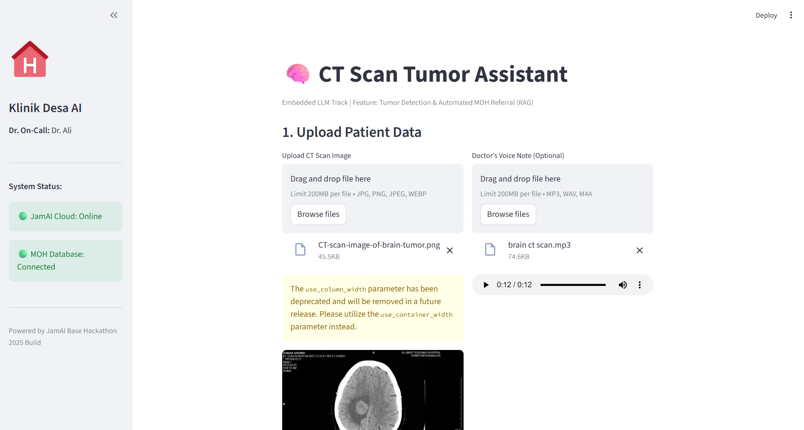
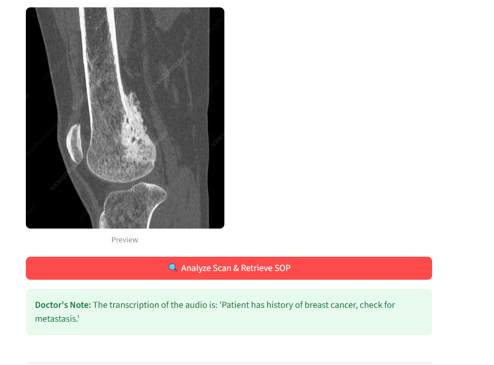
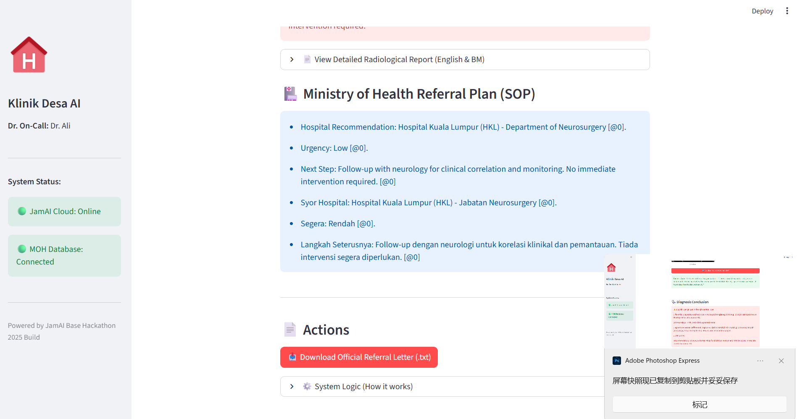
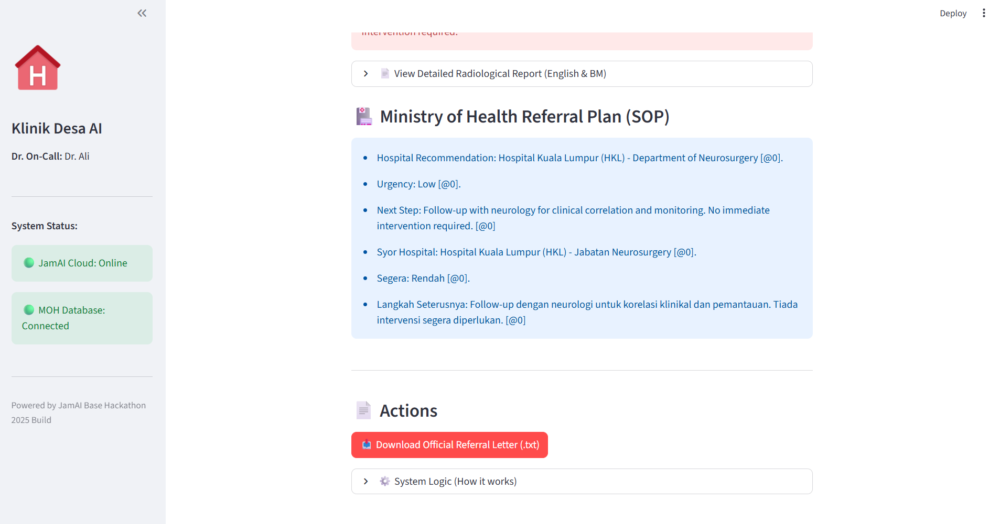
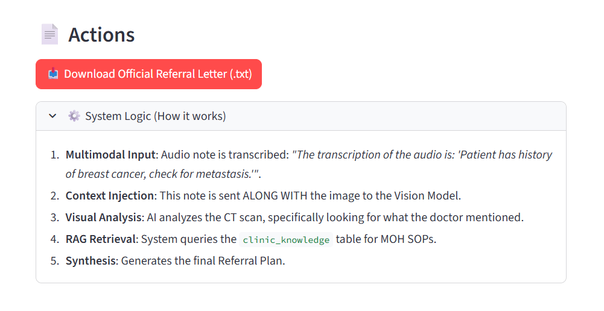
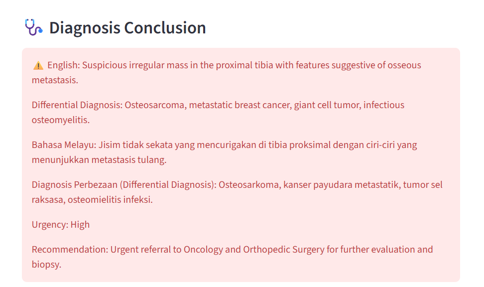

# 🏥 Klinik Desa AI Assistant (Embedded LLM Track)


## 📖 Executive Summary
**Klinik Desa AI** is an intelligent, multimodal medical assistant designed specifically for **Malaysian rural clinics (Klinik Desa)** and District Hospitals.

Addressing the shortage of specialists in rural areas, this system leverages **Embedded LLM** technology to assist Medical Officers (MOs) by:
1.  **Analyzing Medical Imaging** (CT Scans) for tumors/abnormalities.
2.  **Retrieving Official SOPs** via RAG to suggest the correct referral pathway.
3.  **Automating Documentation** by generating official Referral Letters instantly.

---

## 🖼️ Demo Walkthrough

| **1. CT Analysis & Diagnosis** | **2. RAG-Based SOP Retrieval** |
|:---:|:---:|
|  |  |
| *AI detects abnormalities with precision* | *Auto-retrieves MOH Malaysia guidelines* |

| **3. Multimodal (Audio) Input** | **4. Automated Referral Letter** |
|:---:|:---:|
|  |  |
| *Understands doctor's voice notes (Manglish)* | *One-click generation of patient letters* |

| **5. Dynamic Letter Generation** | **6. System Logic Transparency** |
|:---:|:---:|
|  |  |
| *Auto-fills hospital & patient details* | *Full reasoning trace for audit* |

---

## 🌟 Key Features

### 1. 🧠 Multimodal Tumor Detection (Vision + Audio)
* **Visual Intelligence:** Uses **ELLM Qwen3 VL (30B)** to analyze CT Scans, detecting masses, lesions, and density anomalies with high precision.
* **Context Injection:** Accepts doctor's verbal notes (e.g., *"Patient has history of lung cancer"*), transcribes them using **Qwen-2 Audio**, and **injects this context** into the vision model prompt for a more accurate, context-aware diagnosis.

### 2. 🇲🇾 Localized RAG (MOH Guidelines)
* **Problem:** Doctors struggle to memorize complex referral protocols.
* **Solution:** We implemented a **Knowledge Table** containing **Ministry of Health (MOH/KKM) Malaysia Referral Guidelines 2025**.
* **Reasoning Chain:** The system diagnoses the condition $\rightarrow$ Searches the SOP $\rightarrow$ Recommends the correct specialist center (e.g., **Hospital Kuala Lumpur** or **IKN**) based on urgency.

### 3. 🗣️ Bilingual & Manglish Support
* Generates reports in both **English** and **Bahasa Melayu** to support diverse local medical staff.
* Robust audio processing handles Malaysian-accented English (**Manglish**) effectively.

### 4. ⚡ Workflow Automation (End-to-End)
* **Zero Friction:** From scanning to paperwork in under 30 seconds.
* **Actionable Output:** Instantly generates a downloadable `.txt` **Referral Letter**, ready to be printed and given to the patient.

---

## ⚙️ System Architecture & Data Flow

This project implements a sophisticated **Context-Aware RAG Pipeline**:

1.  **Multimodal Ingestion**: Captures **CT Scans (Image)** and **Doctor's Voice Notes (Audio)** via the Streamlit frontend.

2.  **Context Injection Layer**: The audio is transcribed into text and **injected directly** into the Vision Model's prompt. This ensures the AI analyzes the image *while knowing* the patient's clinical history.
3.  **Visual Reasoning**: JamAI's Action Table analyzes the visual data for masses/lesions, cross-referencing with the injected doctor's context.
4.  **Automated RAG Retrieval**: Upon detecting a diagnosis, the system autonomously queries the `clinic_knowledge` table to retrieve the specific **MOH Referral SOPs**.
5.  **SOP-Aligned Synthesis**: The final output combines visual findings, diagnosis, and retrieved government protocols to generate an actionable **Referral Plan** and **Official Letter**.

---

## 🛠️ Tech Stack

* **Frontend Framework**: Streamlit (Python)
* **LLM Orchestration**: **JamAI Base** (Cloud)
* **JamAI Components Used**:
    * **Action Tables**: For chaining Vision, Audio processing, and Reasoning tasks.
    * **Knowledge Tables**: For RAG (Retrieval of MOH SOPs).
* **Models Deployed**:
    * *Vision/Reasoning*: `ellm/Qwen/Qwen3-VL-30B-A3B-Instruct`
    * *Audio*: `ellm/Qwen/Qwen-2-Audio-7B`

---

## 🚀 How to Run Locally

1.  **Clone the Repository**
    ```bash
    git clone <your-repo-url>
    cd <your-repo-folder>
    ```

2.  **Install Dependencies**
    ```bash
    pip install -r requirements.txt
    ```

3.  **Configure Credentials**
    * Open `app_ct.py`.
    * Update `PROJECT_ID` and `PAT` with your JamAI Base credentials.

4.  **Launch the App**
    ```bash
    streamlit run app_ct.py
    ```

---

## 📂 Project Structure

* `app_ct.py`: **Main Application**. Contains the Streamlit frontend and JamAI integration logic.
* `malaysia_referral_sop.txt`: The **Knowledge Base** source document containing MOH guidelines.
* `requirements.txt`: List of Python libraries required.
* `image*.png`: Demo screenshots for documentation.

---

### 🏆 Hackathon Track Checklist
- [x] **Local Impact:** Solves real issues for Malaysian rural clinics.
- [x] **JamAI Base:** Extensive use of Action/Knowledge Tables.
- [x] **Multimodal:** Integrates Image, Audio, and Text.
- [x] **Working Prototype:** Fully functional MVP deployed locally.

---
*Submitted for Universiti Malaya Hackathon 2025 - PEKOM CODE FEST*